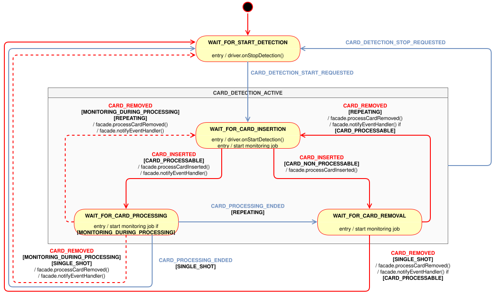

= {doc-title} — {doc-subtitle}
//
// ============================================================================
// Dynamic — update these (everything below is shared / fixed)
// ============================================================================
//
// Per-spec identity
:doc-topic: Reader
:doc-name: Terminal Reader API
:doc-type: Specification
:doc-classification: Public
:doc-id: CNA-TR-API
:doc-ref: YYMMDD-SP-CNATerminalAPI-Reader
:doc-repo: https://github.com/calypsonet/calypsonet-terminal-reader-uml-api
include::assets/logos/_terminal-api.adoc[]
include::assets/legal/_license-cc-by-nd-4.0.adoc[]
//
// Revision (bumped every edition)
:revnumber: 3.0.0-SNAPSHOT
:revdate: 2026-07-20
// API version exposed by the VERSION constant: MAJOR.MINOR of revnumber
:api-version: 3.0
//
// ============================================================================
// Document-specific constants (local — differ per spec)
// ============================================================================
//
// Referenced specifications
:ver-cna-td: 1.0
//
// ============================================================================
// Shared / fixed — identical across every spec
// ============================================================================
//
// Title composition (fixed expression)
:doc-title: {doc-type}
:doc-subtitle: {doc-topic}
:title-separator: —
//
// Publisher and authorship
:organization: Calypso Networks Association
:author: Calypso_Networks_Association
:email: https://calypsonet.org
//
// ============================================================================
// Technical settings — common to all documents (build, rendering, output)
// ============================================================================
//
// Build (works with revdate for deterministic output)
:reproducible:
//
// Output & rendering
:doctype: book
:toc: left
// PDF only: switch the TOC to manual placement so the colophon can sit between
// the title page and the TOC (see the `toc::[]` macro after the colophon).
ifdef::backend-pdf[:toc: macro]
:toclevels: 4
:sectnums:
:sectnumlevels: 3
:sectanchors:
:sectlinks:
:xrefstyle: short
:source-highlighter: rouge
:rouge-style: github
:icons: font
:experimental:
:data-uri:
:webfonts!:
//
// Assets & theming
:docinfodir: {docdir}/assets
:docinfo: shared-head
:docinfo-subs: attributes
:imagesoutdir: {docdir}/generated
:pdf-themesdir: {docdir}/assets
:pdf-theme: pdf
:pdf-fontsdir: {docdir}/assets/fonts
// Web fonts (base64 woff2) — factored out of docinfo.html
include::assets/fonts/_fonts.adoc[]
// Favicon (HTML) — common to all Calypso documents
include::assets/layout/_favicon.adoc[]
// Legal icons — common to all Calypso documents
include::assets/layout/_web.adoc[]
include::assets/layout/_mail.adoc[]
//
// Captions & sectioning
:appendix-caption: Annex
:example-caption: Example
:figure-caption: Figure
:table-caption: Table
:!chapter-signifier:

// Colophon (legal notice) — shared "Link and Contact" front matter. See
// assets/layout/_colophon.adoc.
include::assets/layout/_colophon.adoc[]

[abstract]
== Abstract

This document is the official technical specification of the **{doc-name}** standardised
by the **{organization}** (CNA).
It defines, in a language-agnostic way (using a notation inspired by the Kotlin language), the interfaces,
classes, enumerations, errors, structural relationships and behavioural requirements that any conforming
implementation of the {doc-name} MUST satisfy.

The {doc-name} is part of the broader CNA *Terminal API* family and acts as the contract through which
terminal applications discover card readers, observe card events, select cards and exchange data with them.

[discrete]
== Document Status

[cols="^.^1h,.^3", grid=rows, frame=all]
|===
| Reference           | {doc-ref}
| Short name          | {doc-id}
| Version             | {revnumber}
| Revision date       | {revdate}
| Editor              | {organization}
| Source repository   | {doc-repo}
| Reference license   | {doc-license} ({doc-license-short})
|===

NOTE: The present document specifies the {revnumber} of the {doc-name}. It defines a single, coherent
baseline against which conforming implementations are evaluated; the *Since* column indicates the version in
which each member was introduced.

[discrete]
== Revision List

[NOTE]
====
This section lists the high-level changes per version. The complete, fine-grained
changelog is maintained in the {doc-repo}/blob/HEAD/CHANGELOG.md[`CHANGELOG.md`]
file at the root of the source repository.
====

[cols="^.^1,.^4", options="header"]
|===
| Version / Date | Modifications

| *v{revnumber}* +
{revdate}
| Baseline.
|===

// =============================================================================
== Introduction

=== Purpose

The {doc-name} defines a standardised set of contracts allowing terminal applications to interact with card
readers and the cards presented to them, independently of:

* the underlying reader hardware (contact, contactless, virtual, etc.),
* the card technology family (<<ref_iso7816,ISO/IEC 7816-4>>, <<ref_iso14443,ISO/IEC 14443>>, proprietary),
* the implementation technology of the application (programming language, runtime).

Conforming implementations of this specification MUST allow extension modules (e.g. card-specific APIs such as the
Calypso Card API) to plug in transparently through the Service Provider Interface (SPI) mechanism defined in
`reader.selection.spi` and `reader.transaction.spi`.

=== Scope

This specification covers:

* the discovery and basic interrogation of card readers,
* the observation of reader events related to card presence and selection,
* the configuration of card detection (RF technologies, detection mode, ECP frame),
* the description and orchestration of card selection scenarios, including multi-channel scenarios,
* the abstraction of the physical and logical communication channels established with cards,
* the contract surface required by card extension modules to interoperate with reader implementations,
* the management of single-channel and multi-channel card transactions.

The following topics are *out of scope*:

* the wire-level protocols used between reader and card (e.g. APDU framing, ISO/IEC 14443 anti-collision),
* the cryptographic operations performed by or on behalf of the card,
* the lifecycle and packaging of reader drivers,
* the user interface presented by the terminal application.

=== Conformance

A software product conforms to this specification if and only if:

. it implements every interface and class defined in <<sec_specification>> with the operations and semantics
  prescribed in this document,
. it raises errors exclusively of the types defined in <<sec_errors>> for the situations described,
. it preserves the structural relationships described in <<sec_architecture>>.

Throughout this specification, the key words **MUST**, **MUST NOT**, **SHOULD**, **SHOULD NOT**, **RECOMMENDED**,
**MAY** and **OPTIONAL** are to be interpreted as described in <<ref_rfc2119,RFC 2119>> and <<ref_rfc8174,RFC 8174>> when, and only when,
they appear in all capitals.

In conformance with <<ref_rfc2119,RFC 2119>>, **SHALL** is equivalent to **MUST**; this specification uses **MUST** exclusively in
order to avoid ambiguity.

=== Document Conventions

==== Naming

Type names follow `UpperCamelCase`; operation, parameter and enumeration-member names follow `lowerCamelCase`
except for enumeration values which use `UPPER_SNAKE_CASE`. Names defined by this specification are reproduced
as-is in the UML class diagram (<<sec_class_diagram>>).

==== Data types

The following type names, whose notation is inspired by the Kotlin language, are used in operation signatures
and are mapped, in each binding, to the closest equivalent native type. Implementations MUST preserve the
semantic intent rather than the syntactic form.

[cols="^.^1,.^3,.^3", options="header"]
|===
| Type        | Description                                                                         | Typical bindings
| `String`    | Sequence of characters, UTF-8 encoded by default.                                   | `String`, `string`, `str`.
| `Boolean`   | Two-state truth value.                                                              | `boolean`, `bool`.
| `Int`       | Signed 32-bit integer.                                                              | `int`, `Int32`, `i32`.
| `Long`      | Signed 64-bit integer.                                                              | `long`, `Int64`, `i64`.
| `ByteArray` | Ordered sequence of octets.                                                         | `byte[]`, `[u8]`, `bytes`.
| `List<T>`   | Ordered collection of `T` values, may contain duplicates.                           | `List<T>`, `Vec<T>`.
| `Set<T>`    | Unordered collection of unique `T` values.                                          | `Set<T>`, `HashSet<T>`.
| `Map<K,V>`  | Associative array binding keys of type `K` to values of type `V`.                   | `Map<K,V>`, `Dictionary<K,V>`, `HashMap<K,V>`.
| `Any`       | Value of any type, root of the type hierarchy.                                      | `Object`, `Any`, `object`, `Box<dyn Any>`.
| `T?`        | Nullable value: either a `T` value or `null`.                                       | `Optional<T>`, `T?`, `Option<T>`.
| `null`      | Absence of value, the alternative held by a nullable type.                          | `null`, `nil`, `None`.
| `Self`      | Own type of the receiver: a fluent operation returns the instance it was called on. | `Self`, `T` (recursive generic).
| `Unit`      | Indicates that an operation returns no value.                                       | `void`, `Unit`, `()`.
|===

==== Type tables

Each interface, class, enumeration and error defined in this document is described by a table of the form:

[cols="^.^1h,.^5", grid=rows, frame=all]
|===
| Name       | The type's normalized name.
| Kind       | The category of the type (interface, class, enumeration, error, etc.).
| Namespace  | The namespace in which the type is defined.
| Extends    | The type extended by this type, when applicable.
| Implements | The interface implemented by this type, when applicable.
| Since      | The version of the API in which the type was introduced.
| Purpose    | A normative description of the type's responsibility.
| See also   | Cross-references to related operations or types, each a hyperlink to the corresponding table. Present only when applicable.
|===

The *Purpose* row states, in one or two sentences, the responsibility of the type and the way an instance is
obtained. It is meant to be scanned, not read: any content that requires structure or depth -- rules, lists,
notes, value tables or examples -- is placed as prose below the table.

==== Operation tables

Each operation defined in this document is described by a table of the form:

[cols="^.^1h,.^5", grid=rows, frame=all]
|===
| Signature      | The operation's signature.
| Since          | The version of the API in which the operation was introduced.
| Description    | A normative description of the operation's behaviour.
| Parameters     | A description of each input parameter.
| Returns        | A description of the returned value, if any.
| Pre-conditions | The conditions the caller MUST satisfy before invoking the operation, each prefixed by its nature.
| Errors         | A list of error conditions a correct caller must handle, each mapped to a specific error type.
| See also       | Cross-references to related operations or types, each a hyperlink to the corresponding table. Present only when applicable.
|===

==== Operation contracts

To avoid repetition, the following rules apply to every operation table in <<sec_specification>> and are therefore
not restated for each operation:

* *Pre-conditions.* The *Pre-conditions* row states what the caller MUST guarantee before invoking the
  operation. Violating one is a contract error, never listed in the *Errors* row, which describes only the
  outcomes a correct caller must handle. Each entry is prefixed by its nature, which determines the error
  raised when the condition is not met:
** *Argument* -- an illegal argument error. Applies to any invalid argument, including values bounded by a card or SAM protocol.
** *Range* -- an index out of bounds error. Applies when the argument designates a position within a collection or memory image exposed by the API.
** *State* -- an illegal state error.
** *Capability* -- an unsupported operation error.
* *Non-`null` results.* Unless the return type is marked nullable (`T?`) or the *Returns* row states otherwise, an
  operation returns a non-`null` value.
* *Collections.* Unless the return type is marked nullable (`T?`), an operation whose return type is a collection
  (e.g. `List`, `Set`, `Map`) returns an empty collection rather than `null`.
* *Fluent composition.* Builder-style operations return the current instance so that calls can be chained.

==== Concurrency

Unless explicitly stated otherwise, the stateful types defined by this specification are *not* thread-safe. A given
instance MUST be accessed from a single thread at a time; concurrent use of the same instance without external
synchronisation results in undefined behaviour. Distinct instances MAY be used concurrently.

=== References and Resources

==== Calypso References

References to CNA Terminal APIs designate the indicated *major* version; any later release within the same major
is backward-compatible per that API's evolution policy.

[cols="^.^1,.^4", options="header"]
|===
| Reference | Document

| [[ref_cna_td]] [CNA-TD-API]
| https://docs.terminal-api.calypsonet.org/calypsonet-terminal-definitions-uml-api/[_CNA Terminal API -- Definitions_] (SP-CNATerminalAPI-Definitions), version {ver-cna-td}, {organization}. Provides the `RfTechnology` and `CardType` enumerations referenced by this specification.
|===

==== Normative References

[cols="^.^1,.^4", options="header"]
|===
| Reference | Document

| [[ref_rfc2119]] [RFC 2119]
| https://www.rfc-editor.org/rfc/rfc2119[_Key words for use in RFCs to Indicate Requirement Levels_], S. Bradner, March 1997.

| [[ref_rfc8174]] [RFC 8174]
| https://www.rfc-editor.org/rfc/rfc8174[_Ambiguity of Uppercase vs Lowercase in RFC 2119 Key Words_], B. Leiba, May 2017.

| [[ref_iso7816]] [ISO/IEC 7816]
| https://www.iso.org[_Identification cards -- Integrated circuit cards_].

| [[ref_iso14443]] [ISO/IEC 14443]
| https://www.iso.org[_Identification cards -- Contactless integrated circuit cards -- Proximity cards_].
|===

==== External Resources

[cols="^.^1,.^2", options="header"]
|===
| Resource | Link

| Calypso Networks Association | https://calypsonet.org
| Terminal APIs website        | https://terminal-api.calypsonet.org
| Terminal APIs documentation  | https://docs.terminal-api.calypsonet.org
|===

// =============================================================================
== Glossary and Acronyms

=== Glossary

[cols="^.^1,.^4", options="header"]
|===
| Term              | Definition

| Card              | Any physical or virtual smart card that can be presented to a reader for selection and dialog.
| Card Reader       | Hardware or software component capable of detecting cards and exchanging data with them.
| Card Selection    | Sequence of operations used to identify, filter and prepare a card for application-level dialog.
| Logical Channel   | Software-level communication path established with a card after a successful selection.
| Basic Channel     | The default logical channel (channel `0`) of an ISO/IEC 7816-4 card.
| Multi-Channel     | Capability of an ISO/IEC 7816-4 card to host several active logical channels in parallel.
| Physical Channel  | Hardware-level communication path between the reader and the card.
| Observable Reader | Reader implementation able to notify a registered event handler asynchronously of card-related events.
| Power-on Data     | Data returned by the reader at the moment a card is detected (e.g. ATR, virtual ATR, anti-collision data).
| Card Application  | Application Dedicated File (DF) selected on a card, identified by its AID, as defined in ISO/IEC 7816-4.
| AID               | Application IDentifier as defined in ISO/IEC 7816-4 (5 to 16 bytes).
| APDU              | Application Protocol Data Unit, the message format used between the terminal and the card, as defined in ISO/IEC 7816-3.
| ECP               | Enhanced Contactless Polling, an extended polling mechanism enabling fast card detection in mobile transit deployments.
| RF Technology     | Radio-frequency communication technology used by a contactless reader to detect a card, as defined in ISO/IEC 14443.
| Card Type         | Identified product or transport-protocol family of a detected card.
| SPI               | Service Provider Interface -- a set of interfaces designed to be implemented by an extension module.
|===

=== Acronyms

[cols="^.^1,.^4", options="header"]
|===
| Abbreviation | Expansion

| AID  | Application IDentifier
| APDU | Application Protocol Data Unit
| ATR  | Answer To Reset
| CNA  | Calypso Networks Association
| DF   | Dedicated File
| ECP  | Enhanced Contactless Polling
| FCI  | File Control Information
| FCP  | File Control Parameters
| FMD  | File Management Data
| ISO  | International Organization for Standardization
| RF   | Radio Frequency
| RFC  | Request For Comments
| SPI  | Service Provider Interface
| UML  | Unified Modelling Language
|===

// =============================================================================
[[sec_architecture]]
== Architectural Overview

=== Functional positioning

The {doc-name} sits between the terminal application and the reader drivers, exposing a stable contract on each
side:

.{doc-name} -- Architecture Overview
[plantuml, target=architecture-overview, format=svg]
----
include::uml/architecture-overview.puml[]
----

=== Logical namespaces

[cols=".^3,^.^1,.^5", options="header"]
|===
| Namespace                       | Role     | Summary

| `reader`                      | Public API
| Entry points of the API and the abstractions used to manipulate readers and the events they produce; exposes
  `CardReaderProvider` to discover and access the readers available in the execution environment.

| `reader.spi`                  | SPI
| Contracts implemented by the application (as opposed to the reader implementation) when readers are observed.

| `reader.selection`            | Public API
| Orchestration of card selection scenarios: the hierarchy of card selection managers (one per selection mode),
  the family of selectors, the channel and notification policies and the structures exposing selection results.

| `reader.selection.spi`        | SPI
| Contracts implemented by card extensions to plug into the selection machinery.

| `reader.transaction.spi`      | SPI
| Common contract shared by all card transaction managers exposed by card extensions; its three interfaces form a
  hierarchy letting each extension anchor its transaction manager at the capability level matching its card model
  (non-ISO, optionally multi-channel, intrinsically multi-channel).
|===

=== Multi-channel design

The {doc-name} explicitly supports ISO/IEC 7816-4 cards that host several active logical channels in parallel.
The design follows a three-tier hierarchy in the `reader.transaction.spi` namespace:

. <<type_CardTransactionManager,`CardTransactionManager`>> -- root contract common to every transaction manager,
  regardless of channel model.
. <<type_IsoCardTransactionManager,`IsoCardTransactionManager`>> -- intermediate contract for ISO/IEC 7816-4 cards
  for which multi-channel is an *optional capability* of the underlying card. It exposes the cast operation
  `asMultichannelCardTransactionManager` that returns a <<type_MultichannelCardTransactionManager,
  `MultichannelCardTransactionManager`>> when the card supports it.
. <<type_MultichannelCardTransactionManager,`MultichannelCardTransactionManager`>> -- contract for cards that are
  *intrinsically multi-channel* by design. Consumer APIs whose target cards are always multi-channel SHOULD
  make their transaction manager extend this contract directly.

[[sec_card_selection_modes]]
=== Card selection modes

A card selection scenario -- prepared through one of the card selection managers described in
<<type_CardSelectionManager,`CardSelectionManager`>>, whose type determines the selection mode -- can be operated in
two ways, chosen according to the reader capability and the use case.

[NOTE]
This section is _informative_. It gives an end-to-end view of the two modes; the normative behaviour of each
operation is defined in the sections of the card selection managers.

Synchronous (explicit)::
The card is already present on a <<type_CardReader,`CardReader`>>. The application runs the scenario itself with the
`processCardSelectionScenario` operation of its manager and obtains the corresponding result immediately
(<<type_SingleCardSelectionResult,`SingleCardSelectionResult`>>,
<<type_MultipleCardSelectionResult,`MultipleCardSelectionResult`>> or
<<type_MultichannelCardSelectionResult,`MultichannelCardSelectionResult`>>). The *same entity* manages both the
selection and the subsequent card processing.

Asynchronous (scheduled / event-driven)::
On an <<type_ObservableCardReader,`ObservableCardReader`>>, the scenario is registered ahead of time with
`scheduleCardSelectionScenario` -- available on the single-channel managers
<<type_SingleCardSelectionManager,`SingleCardSelectionManager`>> and
<<type_MultipleCardSelectionManager,`MultipleCardSelectionManager`>> only -- and executed automatically by the
reader upon card insertion. The outcome is delivered as a <<type_CardReaderEvent,`CardReaderEvent`>> to the
<<type_CardReaderEventHandler,`CardReaderEventHandler`>> -- its type (`CARD_MATCHED` or `CARD_INSERTED`) depending on
the <<type_CardPresenceNotificationPolicy,`CardPresenceNotificationPolicy`>> -- and decoded with the
`parseScheduledCardSelectionsResponse` operation of the same manager. Here the *reader* drives the selection while
the *event handler* performs the card processing.

.{doc-name} -- Card Selection Modes Activity Diagram
[plantuml, target="card-selection-modes", format="svg"]
----
include::uml/card-selection-modes.puml[{doc-name} card selection modes activity diagram]
----

The runtime execution of the asynchronous mode -- the reader states and transitions -- is detailed in
<<sec_observation_lifecycle,Reader observation lifecycle>>.

[[sec_observation_lifecycle]]
=== Reader observation lifecycle

An <<type_ObservableCardReader,`ObservableCardReader`>> tracks card insertion and removal through an internal state
machine. The diagram below gives the integrator a complete view of that lifecycle: how
<<op_ObservableCardReader_startCardDetection,`startCardDetection`>> /
<<op_ObservableCardReader_stopCardDetection,`stopCardDetection`>> and
<<op_ObservableCardReader_endCardProcessing,`endCardProcessing`>> move the reader between states, when a
<<type_CardReaderEvent,`CardReaderEvent`>> is produced, and how the <<type_DetectionMode,`DetectionMode`>> and
<<type_CardPresenceNotificationPolicy,`CardPresenceNotificationPolicy`>> settings steer the flow.

[NOTE]
This section is _informative_. The state and trigger names shown are internal to the implementation and are not part
of the normative API surface; they are provided only to explain the observed runtime behavior.

.Card Reader Observation -- FSM State Diagram

The diagram uses the following notation:

*Triggers* -- events that drive the transitions:

* *Application* triggers (blue transitions in the diagram):
** `CARD_DETECTION_START_REQUESTED` -- the application called <<op_ObservableCardReader_startCardDetection,`startCardDetection`>>.
** `CARD_DETECTION_STOP_REQUESTED` -- the application called <<op_ObservableCardReader_stopCardDetection,`stopCardDetection`>> (factorized on the composite-state boundary).
** `CARD_PROCESSING_ENDED` -- the application called <<op_ObservableCardReader_endCardProcessing,`endCardProcessing`>>.
* *Hardware* triggers (red transitions in the diagram):
** `CARD_INSERTED` -- the monitoring job detected a card.
** `CARD_REMOVED` -- the monitoring job detected card removal.

*Reader capabilities*:

* `[MONITORING_DURING_PROCESSING]` -- the reader can detect card removal while processing is running, *AND* card processing is executed in a dedicated thread.

*Card eligibility*:

* `[CARD_PROCESSABLE]` -- the inserted card matched at least one case of the card selection scenario, *OR* the notification policy covers every detected card regardless of selection (`CardPresenceNotificationPolicy == ALWAYS`).
* `[CARD_NON_PROCESSABLE]` -- the inserted card matched no case of the card selection scenario, *AND* the notification policy is restricted to matched cards (`CardPresenceNotificationPolicy == MATCHED_ONLY`).

*Detection mode* -- the active <<type_DetectionMode,`DetectionMode`>>, evaluated when a card-processing cycle ends:

* `[REPEATING]` -- detection resumes after each card-processing cycle, ready for the next card.
* `[SINGLE_SHOT]` -- detection stops after the first card-processing cycle; a new call to <<op_ObservableCardReader_startCardDetection,`startCardDetection`>> is required to detect further cards.

*Actions* -- effect executed on a transition:

* `/ facade.operation()` -- a public API call (event production or event-handler notification).
* `/ driver.operation()` -- a low-level hardware call (hardware notification).
* `/ start job` -- a monitoring job submitted to the background executor.

[[sec_class_diagram]]
=== UML class diagram

The following UML class diagram provides a visual representation of the types and relationships defined by this specification:

.{doc-name} -- UML Class Diagram
[plantuml, target="class-diagram", format="svg"]
----
include::uml/class-diagram.puml[Terminal Reader API class diagram]
----

// =============================================================================
[[sec_specification]]
== API Specification

=== Constants

[[type_ReaderApiProperties]]
==== Reader API Properties

[cols="^.^1h,.^5", grid=rows, frame=all]
|===
| Name       | `ReaderApiProperties`
| Kind       | Constants
| Namespace  | `reader`
| Since      | 1.0
| Purpose    | Exposes the immutable properties of the {doc-name}.
|===

[cols="^.^1,^.^1,^.^1,.^4", options="header"]
|===
| Name      | Type     | Since | Description

| `VERSION` | `String` | 1.0 | String representation of the version of the API implemented by the conforming binding.
  The value is a dotted decimal of the form `MAJOR.MINOR`; it is `"{api-version}"` for this revision of the specification.
|===

=== Data

[[type_BasicCardSelector]]
==== Basic Card Selector

[cols="^.^1h,.^5", grid=rows, frame=all]
|===
| Name       | `BasicCardSelector`
| Kind       | Data
| Namespace  | `reader.selection`
| Implements | <<type_CardSelector,`CardSelector`>>
| Since      | 2.0
| Purpose    | Basic, technology-agnostic card selector, built directly by the application.
|===

`BasicCardSelector` carries no ISO/IEC 7816-4-specific filter; it exists to express their absence at the
type level. Every filter is *optional* and MAY be combined with the others. When no filter is set, any card
that responds when presented to the reader is considered selected; when one or more filters are set, the card
is rejected as soon as one of them does not match.

[cols="^.^1,^.^1,^.^1,^.^1,.^5", options="header"]
|===
| Name | Type | Default | Since | Description

| `cardType`
| `CardType?` (<<ref_cna_td,CNA-TD-API>>)
| `null`
| 3.0
| Restricts the selection to cards whose detected type matches this value. The value `UNKNOWN` MAY be
  used to capture cards whose type could not be identified. `null` disables the filter.

| `powerOnDataRegex`
| `String?`
| `null`
| 2.0
| Restricts the selection to cards whose power-on data, as provided by the reader, matches this regular
  expression. `null` disables the filter.
|===

[[type_CardDetectionSettings]]
==== Card Detection Settings

[cols="^.^1h,.^5", grid=rows, frame=all]
|===
| Name       | `CardDetectionSettings`
| Kind       | Data
| Namespace  | `reader`
| Since      | 3.0
| Purpose    | Carries the configuration of a card detection cycle, built directly by the application.
|===

[cols="^.^1,^.^1,^.^1,^.^1,.^5", options="header"]
|===
| Name | Type | Default | Since | Description

| `detectionMode`
| <<type_DetectionMode,`DetectionMode`>>
| `DetectionMode.REPEATING`
| 3.0
| Governs the reader behaviour once a card-processing cycle has terminated. With `REPEATING`, the reader
  automatically resumes polling and waits for the next card insertion, enabling continuous, unattended
  operation. With `SINGLE_SHOT`, the reader stops detection after the current cycle; a new call to
  <<op_ObservableCardReader_startCardDetection,`startCardDetection`>> is required before another card can
  be detected.

| `rfTechnologies`
| `Set<RfTechnology>` (<<ref_cna_td,CNA-TD-API>>)
| `setOf(RfTechnology.ISO_14443_AB)`
| 3.0
| The set of RF technologies the reader activates during polling. Not relevant for contact readers, where
  it is accepted without effect. MUST NOT be empty.

| `ecpFrame`
| `ByteArray?`
| `null`
| 3.0
| The ECP (Enhanced Contactless Polling) frame to emit at polling startup, treated by this specification
  as opaque binary data constructed by the application in accordance with the relevant ECP specification
  and transmitted as-is to the reader. Relevant only on readers supporting ECP; on the others the frame is
  silently ignored and a `WARN`-level message is typically logged. `null` means that no ECP frame is
  emitted. When set, it MUST NOT be empty.
|===

[[type_CardReaderEvent]]
==== Card Reader Event

[cols="^.^1h,.^5", grid=rows, frame=all]
|===
| Name       | `CardReaderEvent`
| Kind       | Data
| Namespace  | `reader`
| Since      | 1.0
| Purpose    | Data container describing a change of state observed by a `CardReader`.
|===

A `CardReaderEvent` carries the origin of the event (the reader name), the event type and, when available,
the card selection response. The circumstances under which each event type is emitted are described in
<<sec_observation_lifecycle,Reader observation lifecycle>>.

[cols="^.^1,^.^1,^.^1,^.^1,.^5", options="header"]
|===
| Name | Type | Default | Since | Description

| `readerName`
| `String`
| --
| 1.0
| Name of the reader that generated the event. Non-empty.

| `type`
| <<type_CardReaderEventType,`CardReaderEventType`>>
| --
| 1.0
| Type of the event.

| `scheduledCardSelectionsResponse`
| <<type_ScheduledCardSelectionsResponse,`ScheduledCardSelectionsResponse`>>?
| --
| 1.0
| Response of the selection scenario scheduled on the reader. It is `null` *only* when no selection
  scenario has been scheduled; in every other case it is non-`null`. When non-`null`, it MUST be passed for
  interpretation to the `parseScheduledCardSelectionsResponse` operation of the card selection manager that
  scheduled the associated selection scenario, or of another manager of the same type sharing the same
  context -- that is, one that has previously prepared the same selection scenario.
|===

[[type_IsoCardSelector]]
==== ISO Card Selector

[cols="^.^1h,.^5", grid=rows, frame=all]
|===
| Name       | `IsoCardSelector`
| Kind       | Data
| Namespace  | `reader.selection`
| Implements | <<type_CardSelector,`CardSelector`>>
| Since      | 2.0
| Purpose    | ISO/IEC 7816-4 card selector, built directly by the application.
|===

`IsoCardSelector` adds the ISO/IEC 7816-4-specific filters to those common to every selector. They are all
*optional* and MAY be combined. When no filter is set, any card that responds when presented to the reader is
considered selected; when one or more filters are set, the card is rejected as soon as one of them does not
match.

[cols="^.^1,^.^1,^.^1,^.^1,.^5", options="header"]
|===
| Name | Type | Default | Since | Description

| `cardType`
| `CardType?` (<<ref_cna_td,CNA-TD-API>>)
| `null`
| 3.0
| Restricts the selection to cards whose detected type matches this value. The value `UNKNOWN` MAY be
  used to capture cards whose type could not be identified. `null` disables the filter.

| `powerOnDataRegex`
| `String?`
| `null`
| 2.0
| Restricts the selection to cards whose power-on data, as provided by the reader, matches this regular
  expression. `null` disables the filter.

| `dfName`
| `ByteArray?`
| `null`
| 2.0
| Selects a card application DF by its name: the DF is selected only if its name starts with this AID, as
  defined by ISO/IEC 7816-4 section 4.2. The value is used as a parameter of the *Select Application* ISO
  card command and MUST contain 5 to 16 bytes. `null` disables the filter.

| `fileOccurrence`
| <<type_FileOccurrence,`FileOccurrence`>>
| `FileOccurrence.FIRST`
| 2.0
| File occurrence mode (see ISO/IEC 7816-4).

| `fileControlInformation`
| <<type_FileControlInformation,`FileControlInformation`>>
| `FileControlInformation.FCI`
| 2.0
| File control mode (see ISO/IEC 7816-4).
|===

[[type_MultichannelCardSelectionResult]]
==== Multichannel Card Selection Result

[cols="^.^1h,.^5", grid=rows, frame=all]
|===
| Name       | `MultichannelCardSelectionResult`
| Kind       | Data
| Namespace  | `reader.selection`
| Since      | 3.0
| Purpose    | Result of a selection scenario executed by a <<type_MultichannelCardSelectionManager,`MultichannelCardSelectionManager`>>.
|===

Each successful selection case has been placed on its own logical channel. All the smart cards exposed by the result
are active in parallel; the one placed on the basic channel, if any, is identified through
<<op_IsoSmartCard_isBasicChannel,`IsoSmartCard.isBasicChannel`>>.

[cols="^.^1,^.^1,^.^1,^.^1,.^5", options="header"]
|===
| Name | Type | Default | Since | Description

| `cardType`
| `CardType` (<<ref_cna_td,CNA-TD-API>>)
| --
| 3.0
| Type of the detected card, as defined by the `CardType` enumeration of the Terminal Definitions API
  (see <<ref_cna_td,CNA-TD-API>>). `UNKNOWN` when the card type could not be identified. The value is
  intrinsically tied to the lifecycle of this result.

| `smartCards`
| `Map<Int, SmartCard>`
| --
| 3.0
| All <<type_SmartCard,`SmartCard`>> instances corresponding to successful selection cases, each active on its own
  logical channel, indexed by the `selectionId` supplied to `prepareSelection`. Possibly empty.
|===

[[type_MultipleCardSelectionResult]]
==== Multiple Card Selection Result

[cols="^.^1h,.^5", grid=rows, frame=all]
|===
| Name       | `MultipleCardSelectionResult`
| Kind       | Data
| Namespace  | `reader.selection`
| Since      | 3.0
| Purpose    | Result of a selection scenario executed by a <<type_MultipleCardSelectionManager,`MultipleCardSelectionManager`>>.
|===

Every selection case of the scenario has been tried. The result exposes the smart cards of all the successful
selection cases, indexed by their `selectionId`. Since the card is operated on a single channel, only the smart card
of the last successful selection case, in execution order, remains active; the others are deactivated but still
expose the data collected during their selection (see <<sec_smartcard_lifecycle,the `SmartCard` lifecycle>>).
`activeSelectionId` is `null` if and only if `smartCards` is empty.

[cols="^.^1,^.^1,^.^1,^.^1,.^5", options="header"]
|===
| Name | Type | Default | Since | Description

| `cardType`
| `CardType` (<<ref_cna_td,CNA-TD-API>>)
| --
| 3.0
| Type of the detected card, as defined by the `CardType` enumeration of the Terminal Definitions API
  (see <<ref_cna_td,CNA-TD-API>>). `UNKNOWN` when the card type could not be identified. The value is
  intrinsically tied to the lifecycle of this result.

| `smartCards`
| `Map<Int, SmartCard>`
| --
| 3.0
| All <<type_SmartCard,`SmartCard`>> instances corresponding to successful selection cases, indexed by the
  `selectionId` supplied to `prepareSelection`. Possibly empty.

| `activeSelectionId`
| `Int?`
| --
| 3.0
| Identifier of the last successful selection case in execution order, whose smart card is the only one remaining
  active, or `null` if no selection case succeeded. When non-`null`, it is a key of `smartCards`.
|===

[[type_SingleCardSelectionResult]]
==== Single Card Selection Result

[cols="^.^1h,.^5", grid=rows, frame=all]
|===
| Name       | `SingleCardSelectionResult`
| Kind       | Data
| Namespace  | `reader.selection`
| Since      | 3.0
| Purpose    | Result of a selection scenario executed by a <<type_SingleCardSelectionManager,`SingleCardSelectionManager`>>.
|===

The execution stops at the first successful selection case, so the result exposes at most one smart card,
identified by the `selectionId` supplied to `prepareSelection`. `selectionId` and `smartCard` are either both
`null`, when no selection case succeeded, or both non-`null`.

[cols="^.^1,^.^1,^.^1,^.^1,.^5", options="header"]
|===
| Name | Type | Default | Since | Description

| `cardType`
| `CardType` (<<ref_cna_td,CNA-TD-API>>)
| --
| 3.0
| Type of the detected card, as defined by the `CardType` enumeration of the Terminal Definitions API
  (see <<ref_cna_td,CNA-TD-API>>). `UNKNOWN` when the card type could not be identified. The value is
  intrinsically tied to the lifecycle of this result.

| `selectionId`
| `Int?`
| --
| 3.0
| Identifier of the successful selection case, or `null` if no selection case succeeded.

| `smartCard`
| <<type_SmartCard,`SmartCard`>>?
| --
| 3.0
| The active <<type_SmartCard,`SmartCard`>> produced by the successful selection case, or `null` if no selection
  case succeeded.
|===

=== API Interfaces

[[type_CardReader]]
==== Card Reader

[cols="^.^1h,.^5", grid=rows, frame=all]
|===
| Name       | `CardReader`
| Kind       | Interface
| Namespace  | `reader`
| Since      | 1.0
| Purpose    | Represents a card reader capable of driving the underlying hardware to manage card detection.
|===

[[op_CardReader_getName]]
===== Get Name

[cols="^.^1h,.^5", grid=rows, frame=all]
|===
| Signature      | `getName() -> String`
| Since          | 1.0
| Description    | Returns the name of the reader.
| Returns        | A non-empty `String` identifying the reader. The value is stable for the lifetime of the reader instance.
| Pre-conditions | None.
| Errors         | None.
|===

[[op_CardReader_isCardPresent]]
===== Is Card Present

[cols="^.^1h,.^5", grid=rows, frame=all]
|===
| Signature      | `isCardPresent() -> Boolean`
| Since          | 1.0
| Description
| Indicates whether a card is currently detected by the reader. What counts as *present* depends on the reader's
  communication mode (see `isContactless`): on a *contact* reader, a card is present when it is physically inserted
  in the slot; on a *contactless* reader, a card is present when it lies within range of the antenna (in the RF
  field).
| Returns        | `true` if a card is present -- inserted for a contact reader, or within the field for a contactless reader -- `false` otherwise.
| Pre-conditions | None.
| Errors         | <<type_ReaderCommunication,`ReaderCommunication`>> -- if the communication with the reader has failed.
|===

[[op_CardReader_isContactless]]
===== Is Contactless

[cols="^.^1h,.^5", grid=rows, frame=all]
|===
| Signature      | `isContactless() -> Boolean`
| Since          | 1.0
| Description    | Indicates whether the card communication mode is contactless.
| Returns        | `true` if the communication mode is contactless, `false` otherwise.
| Pre-conditions | None.
| Errors         | None.
|===

[[type_CardReaderProvider]]
==== Card Reader Provider

[cols="^.^1h,.^5", grid=rows, frame=all]
|===
| Name       | `CardReaderProvider`
| Kind       | Interface
| Namespace  | `reader`
| Since      | 3.0
| Purpose    | Standardised discovery and access surface for the card readers available in the execution environment.
|===

The `CardReaderProvider` is obtained from the <<type_ReaderApiFactory,`ReaderApiFactory`>>. It offers an
implementation-agnostic view over the readers currently registered in the environment. Reader lifecycle (registration and un-registration) is handled by the runtime environment; the provider is a
*read-only* view reflecting the readers active at the moment of each call.

[[op_CardReaderProvider_findReader]]
===== Find Reader

[cols="^.^1h,.^5", grid=rows, frame=all]
|===
| Signature      | `findReader(readerNameRegex: String) -> CardReader?`
| Since          | 3.0
| Description
| Returns the first reader whose name matches the supplied regular expression. This lookup is convenient when reader
  names embed variable elements (serial numbers, USB port index, etc.) that the application cannot
  hard-code.
| Parameters     | `readerNameRegex` -- the regular expression matched against the reader names.
| Returns        | A <<type_CardReader,`CardReader`>> whose name matches the expression, or `null` if none matches.
| Pre-conditions | *Argument* -- every parameter is non-`null`. +
  *Argument* -- the supplied string is a valid regular expression.
| Errors         | None.
|===

[[op_CardReaderProvider_getReader]]
===== Get Reader

[cols="^.^1h,.^5", grid=rows, frame=all]
|===
| Signature      | `getReader(readerName: String) -> CardReader?`
| Since          | 3.0
| Description    | Returns the reader whose name exactly matches the supplied string.
| Parameters     | `readerName` -- the exact name of the reader to retrieve.
| Returns        | A <<type_CardReader,`CardReader`>> whose name equals `readerName`, or `null` if no such reader is registered.
| Pre-conditions | *Argument* -- every parameter is non-`null`.
| Errors         | None.
|===

[[op_CardReaderProvider_getReaderNames]]
===== Get Reader Names

[cols="^.^1h,.^5", grid=rows, frame=all]
|===
| Signature      | `getReaderNames() -> Set<String>`
| Since          | 3.0
| Description    | Returns the names of all readers currently registered in the execution environment.
| Returns        | A `Set` of reader names; empty if no reader is registered.
| Pre-conditions | None.
| Errors         | None.
|===

[[op_CardReaderProvider_getReaders]]
===== Get Readers

[cols="^.^1h,.^5", grid=rows, frame=all]
|===
| Signature      | `getReaders() -> Set<CardReader>`
| Since          | 3.0
| Description    | Returns all readers currently registered in the execution environment.
| Returns        | A `Set` of <<type_CardReader,`CardReader`>> references; empty if no reader is registered.
| Pre-conditions | None.
| Errors         | None.
|===

[[type_CardSelectionManager]]
==== Card Selection Manager

[cols="^.^1h,.^5", grid=rows, frame=all]
|===
| Name       | `CardSelectionManager`
| Kind       | Interface
| Namespace  | `reader.selection`
| Since      | 1.0
| Purpose    | Common contract of the card selection managers: preparation of the card selection scenario and export/import of the scenario and of its processed result. An instance is obtained through one of the specialised managers created by the <<type_ReaderApiFactory,`ReaderApiFactory`>>.
|===

A *card selection scenario* is composed of one or more *selection cases*, each identified by an application-chosen
identifier and backed by a <<type_CardSelectionExtension,`CardSelectionExtension`>>. A selection case targets a
specific card and MAY define additional commands to be executed after the successful selection. Selection cases are
executed in the order in which they were prepared, regardless of their identifiers. When a selection case fails, the
manager tries the next selection case defined in the scenario, until no further selection case is available.
All the selection cases of a scenario target the same card presented to the reader: the terms *single* and
*multiple* in the names of the managers refer to the number of successful selections retained in the result,
not to a number of cards.

The selection mode is not a parameter of the execution: it is carried by the type of the manager, each specialised
manager being obtained from its own factory operation and producing its own result type.

[cols="^.^2,.^4,^.^2,^.^2", options="header"]
|===
| Manager | Behaviour | Execution | Result

| <<type_SingleCardSelectionManager,`SingleCardSelectionManager`>>
| Single-channel. Stops at the first successful selection case.
| Explicit or scheduled
| <<type_SingleCardSelectionResult,`SingleCardSelectionResult`>>

| <<type_MultipleCardSelectionManager,`MultipleCardSelectionManager`>>
| Single-channel. Processes every selection case regardless of intermediate successes.
| Explicit or scheduled
| <<type_MultipleCardSelectionResult,`MultipleCardSelectionResult`>>

| <<type_MultichannelCardSelectionManager,`MultichannelCardSelectionManager`>>
| ISO/IEC 7816-4 multi-channel cards. Places each successful selection case on its own logical channel, according to
  a <<type_ChannelSelectionPolicy,`ChannelSelectionPolicy`>>.
| Explicit
| <<type_MultichannelCardSelectionResult,`MultichannelCardSelectionResult`>>
|===

This interface carries the operations common to the three modes. The operations whose result depends on the mode --
execution, scheduling, parsing of a scheduled response and import of a processed scenario -- are defined by each
specialised manager. See <<sec_card_selection_modes,Card selection modes>> for an end-to-end view of the synchronous
and asynchronous flows.

A scenario is considered *prepared* once at least one selection case has been appended via `prepareSelection` or
imported via `importCardSelectionScenario`. A prepared scenario MAY be executed multiple times; each execution
operates on the scenario as it stood at the time of the call.

[[op_CardSelectionManager_exportCardSelectionScenario]]
===== Export Card Selection Scenario

[cols="^.^1h,.^5", grid=rows, frame=all]
|===
| Signature      | `exportCardSelectionScenario() -> String`
| Since          | 1.1
| Description    | Exports the content of the current prepared selection scenario, including the identifiers of its selection cases, as a `String`. The result MAY be imported into any card selection manager, whatever its type, via `importCardSelectionScenario`.
| Returns        | A non-empty `String`.
| Pre-conditions | None.
| Errors         | None.
| See also       | <<op_CardSelectionManager_importCardSelectionScenario,`importCardSelectionScenario`>>
|===

[[op_CardSelectionManager_exportProcessedCardSelectionScenario]]
===== Export Processed Card Selection Scenario

[cols="^.^1h,.^5", grid=rows, frame=all]
|===
| Signature      | `exportProcessedCardSelectionScenario() -> String`
| Since          | 1.3
| Description
| Exports the content of the previously processed selection scenario as a `String`. The result MAY be imported
  through the `importProcessedCardSelectionScenario` operation of a manager of the same type.

  *Caution:* if the local environment does not have all the card extensions involved in the scenario, the
  selection result produced locally will not contain any active selection. In that case, the processed
  scenario MUST be exported so that it can be re-imported and interpreted on a manager which has the relevant
  card extensions.
| Returns        | A non-empty `String`.
| Pre-conditions | *State* -- the scenario has been processed successfully, via `processCardSelectionScenario` or
  `parseScheduledCardSelectionsResponse`.
| Errors         | None.
| See also
| <<op_SingleCardSelectionManager_importProcessedCardSelectionScenario,`SingleCardSelectionManager.importProcessedCardSelectionScenario`>> +
  <<op_MultipleCardSelectionManager_importProcessedCardSelectionScenario,`MultipleCardSelectionManager.importProcessedCardSelectionScenario`>> +
  <<op_MultichannelCardSelectionManager_importProcessedCardSelectionScenario,`MultichannelCardSelectionManager.importProcessedCardSelectionScenario`>>
|===

[[op_CardSelectionManager_importCardSelectionScenario]]
===== Import Card Selection Scenario

[cols="^.^1h,.^5", grid=rows, frame=all]
|===
| Signature      | `importCardSelectionScenario(cardSelectionScenario: String) -> Self`
| Since          | 1.1
| Description    | Replaces the current scenario with a previously exported scenario, including the identifiers of its selection cases. The selection cases prepared or imported before the call are discarded.
| Parameters     | `cardSelectionScenario` -- the `String` containing the exported card selection scenario.
| Returns        | The current instance (`Self`).
| Pre-conditions | *Argument* -- every parameter is non-`null`. +
  *Argument* -- the string has been produced by `exportCardSelectionScenario` and is well-formed.
| Errors         | None.
| See also       | <<op_CardSelectionManager_exportCardSelectionScenario,`exportCardSelectionScenario`>>
|===

[[op_CardSelectionManager_prepareSelection]]
===== Prepare Selection

[cols="^.^1h,.^5", grid=rows, frame=all]
|===
| Signature
| `prepareSelection(` +
`{nbsp}{nbsp}{nbsp}{nbsp}selectionId: Int,` +
`{nbsp}{nbsp}{nbsp}{nbsp}cardSelector: CardSelector,` +
`{nbsp}{nbsp}{nbsp}{nbsp}cardSelectionExtension: CardSelectionExtension` +
`) -> Self`
| Since          | 2.0
| Description
| Appends a selection case, identified by `selectionId`, to the scenario. Selection cases are executed in the order
  in which they were prepared, regardless of their identifiers. The identifier is the key under which the
  corresponding <<type_SmartCard,`SmartCard`>> is exposed in the selection result.
| Parameters
| `selectionId` -- the identifier of the selection case, chosen by the application. +
  `cardSelector` (<<type_CardSelector,`CardSelector`>>) -- the card selector containing the filters to be used to select the card. +
  `cardSelectionExtension` (<<type_CardSelectionExtension,`CardSelectionExtension`>>) -- the card selection extension to be used to parse the card selection response.
| Returns        | The current instance (`Self`).
| Pre-conditions | *Argument* -- every parameter is non-`null`. +
  *Argument* -- `selectionId` is not already used by a selection case of the scenario.
| Errors         | None.
|===

[[type_CardSelector]]
==== Card Selector

[cols="^.^1h,.^5", grid=rows, frame=all]
|===
| Name       | `CardSelector`
| Kind       | Sealed interface
| Namespace  | `reader.selection`
| Since      | 2.0
| Purpose    | Common supertype of the card selectors. Carries no member; it exists to let an operation accept any selector.
|===

Its permitted implementations are <<type_BasicCardSelector,`BasicCardSelector`>> and
<<type_IsoCardSelector,`IsoCardSelector`>>, which carry the filters restricting the selection process.

[[type_MultichannelCardSelectionManager]]
==== Multichannel Card Selection Manager

[cols="^.^1h,.^5", grid=rows, frame=all]
|===
| Name       | `MultichannelCardSelectionManager`
| Kind       | Interface
| Namespace  | `reader.selection`
| Extends    | <<type_CardSelectionManager,`CardSelectionManager`>>
| Since      | 3.0
| Purpose    | Card selection manager for ISO/IEC 7816-4 multi-channel cards, placing each successful selection case on its own logical channel. An instance is obtained via <<op_ReaderApiFactory_createMultichannelCardSelectionManager,`ReaderApiFactory.createMultichannelCardSelectionManager`>>.
|===

Each successful selection case is placed on its own logical channel of the ISO/IEC 7816-4 card, the use of the
basic channel being governed by the <<type_ChannelSelectionPolicy,`ChannelSelectionPolicy`>> passed at execution
time. All the smart cards of the resulting
<<type_MultichannelCardSelectionResult,`MultichannelCardSelectionResult`>> remain active in parallel. Only the
explicit execution is available: scheduled selection is not supported in multi-channel mode.

[[op_MultichannelCardSelectionManager_importProcessedCardSelectionScenario]]
===== Import Processed Card Selection Scenario

[cols="^.^1h,.^5", grid=rows, frame=all]
|===
| Signature
| `importProcessedCardSelectionScenario(` +
`{nbsp}{nbsp}{nbsp}{nbsp}processedCardSelectionScenario: String` +
`) -> MultichannelCardSelectionResult`
| Since          | 3.0
| Description    | Imports a previously exported *processed* selection scenario and returns the corresponding result.
| Parameters     | `processedCardSelectionScenario` -- the `String` containing the exported processed card selection scenario.
| Returns        | A <<type_MultichannelCardSelectionResult,`MultichannelCardSelectionResult`>>.
| Pre-conditions | *Argument* -- every parameter is non-`null`. +
  *Argument* -- the string has been produced by `exportProcessedCardSelectionScenario` of a `MultichannelCardSelectionManager`, is
  well-formed and contains no more selection cases than the current scenario. +
  *State* -- the manager has been configured with the same selection scenario as the manager that produced the
  export. +
  *Capability* -- the local environment possesses every card extension involved in the scenario.
| Errors         | <<type_InvalidCardResponse,`InvalidCardResponse`>> -- if the data returned by the card could not be interpreted.
| See also       | <<op_CardSelectionManager_exportProcessedCardSelectionScenario,`exportProcessedCardSelectionScenario`>>
|===

[[op_MultichannelCardSelectionManager_processCardSelectionScenario]]
===== Process Card Selection Scenario

[cols="^.^1h,.^5", grid=rows, frame=all]
|===
| Signature
| `processCardSelectionScenario(` +
`{nbsp}{nbsp}{nbsp}{nbsp}reader: CardReader,` +
`{nbsp}{nbsp}{nbsp}{nbsp}channelSelectionPolicy: ChannelSelectionPolicy` +
`) -> MultichannelCardSelectionResult`
| Since          | 3.0
| Description
| Explicitly executes the previously prepared selection scenario in *multi-channel* mode against the provided
  reader, placing each successful selection case on its own logical channel according to the requested channel
  policy, and returns the result.

  If the presented card is not a multi-channel ISO/IEC 7816-4 card, an `InvalidCardResponse` is raised at
  scenario execution time.
| Parameters
| `reader` (<<type_CardReader,`CardReader`>>) -- the reader through which the card is reached. +
  `channelSelectionPolicy` (<<type_ChannelSelectionPolicy,`ChannelSelectionPolicy`>>) -- the policy governing the channels on which selections are placed.
| Returns        | A <<type_MultichannelCardSelectionResult,`MultichannelCardSelectionResult`>>.
| Pre-conditions | *Argument* -- every parameter is non-`null`.
| Errors
| <<type_ReaderCommunication,`ReaderCommunication`>> -- if communication with the reader has failed. +
  <<type_CardCommunication,`CardCommunication`>> -- if communication with the card has failed. +
  <<type_InvalidCardResponse,`InvalidCardResponse`>> -- if the card does not support multi-channel or returned invalid data.
|===

[[type_MultipleCardSelectionManager]]
==== Multiple Card Selection Manager

[cols="^.^1h,.^5", grid=rows, frame=all]
|===
| Name       | `MultipleCardSelectionManager`
| Kind       | Interface
| Namespace  | `reader.selection`
| Extends    | <<type_CardSelectionManager,`CardSelectionManager`>>
| Since      | 3.0
| Purpose    | Card selection manager processing every selection case regardless of intermediate successes. An instance is obtained via <<op_ReaderApiFactory_createMultipleCardSelectionManager,`ReaderApiFactory.createMultipleCardSelectionManager`>>.
|===

Every selection case is tried, in the order in which they were prepared, whatever the outcome of the previous ones.
Since the card is operated on a single channel, each successful selection deactivates the smart card produced by
the previous one: in the resulting <<type_MultipleCardSelectionResult,`MultipleCardSelectionResult`>>, only the
smart card of the last successful selection case remains active. To keep several selections active in parallel on
a multi-channel ISO/IEC 7816-4 card, the <<type_MultichannelCardSelectionManager,`MultichannelCardSelectionManager`>>
MUST be used instead. The scenario can be executed explicitly, on a card already present, or scheduled on an
<<type_ObservableCardReader,`ObservableCardReader`>>.

[[op_MultipleCardSelectionManager_importProcessedCardSelectionScenario]]
===== Import Processed Card Selection Scenario

[cols="^.^1h,.^5", grid=rows, frame=all]
|===
| Signature
| `importProcessedCardSelectionScenario(` +
`{nbsp}{nbsp}{nbsp}{nbsp}processedCardSelectionScenario: String` +
`) -> MultipleCardSelectionResult`
| Since          | 3.0
| Description    | Imports a previously exported *processed* selection scenario and returns the corresponding result.
| Parameters     | `processedCardSelectionScenario` -- the `String` containing the exported processed card selection scenario.
| Returns        | A <<type_MultipleCardSelectionResult,`MultipleCardSelectionResult`>>.
| Pre-conditions | *Argument* -- every parameter is non-`null`. +
  *Argument* -- the string has been produced by `exportProcessedCardSelectionScenario` of a `MultipleCardSelectionManager`, is
  well-formed and contains no more selection cases than the current scenario. +
  *State* -- the manager has been configured with the same selection scenario as the manager that produced the
  export. +
  *Capability* -- the local environment possesses every card extension involved in the scenario.
| Errors         | <<type_InvalidCardResponse,`InvalidCardResponse`>> -- if the data returned by the card could not be interpreted.
| See also       | <<op_CardSelectionManager_exportProcessedCardSelectionScenario,`exportProcessedCardSelectionScenario`>>
|===

[[op_MultipleCardSelectionManager_parseScheduledCardSelectionsResponse]]
===== Parse Scheduled Card Selections Response

[cols="^.^1h,.^5", grid=rows, frame=all]
|===
| Signature
| `parseScheduledCardSelectionsResponse(` +
`{nbsp}{nbsp}{nbsp}{nbsp}scheduledCardSelectionsResponse: ScheduledCardSelectionsResponse` +
`) -> MultipleCardSelectionResult`
| Since          | 3.0
| Description    | Analyses the responses provided by a <<type_CardReaderEvent,`CardReaderEvent`>> following the insertion of a card and the execution of the selection scenario scheduled with `scheduleCardSelectionScenario`.
| Parameters     | `scheduledCardSelectionsResponse` (<<type_ScheduledCardSelectionsResponse,`ScheduledCardSelectionsResponse`>>) -- the card selection scenario execution response.
| Returns        | A <<type_MultipleCardSelectionResult,`MultipleCardSelectionResult`>>.
| Pre-conditions | *Argument* -- every parameter is non-`null`.
| Errors         | <<type_InvalidCardResponse,`InvalidCardResponse`>> -- if the data returned by the card could not be interpreted.
|===

[[op_MultipleCardSelectionManager_processCardSelectionScenario]]
===== Process Card Selection Scenario

[cols="^.^1h,.^5", grid=rows, frame=all]
|===
| Signature
| `processCardSelectionScenario(` +
`{nbsp}{nbsp}{nbsp}{nbsp}reader: CardReader` +
`) -> MultipleCardSelectionResult`
| Since          | 3.0
| Description
| Explicitly executes the previously prepared selection scenario against the provided reader, processing every
  selection case regardless of intermediate successes, and returns the result.
| Parameters
| `reader` (<<type_CardReader,`CardReader`>>) -- the reader through which the card is reached.
| Returns        | A <<type_MultipleCardSelectionResult,`MultipleCardSelectionResult`>>.
| Pre-conditions | *Argument* -- every parameter is non-`null`.
| Errors
| <<type_ReaderCommunication,`ReaderCommunication`>> -- if communication with the reader has failed. +
  <<type_CardCommunication,`CardCommunication`>> -- if communication with the card has failed. +
  <<type_InvalidCardResponse,`InvalidCardResponse`>> -- if the card returned invalid data during the selection process, or if the
  status word check is enabled in the card request and the card returned an unexpected code.
|===

[[op_MultipleCardSelectionManager_scheduleCardSelectionScenario]]
===== Schedule Card Selection Scenario

[cols="^.^1h,.^5", grid=rows, frame=all]
|===
| Signature
| `scheduleCardSelectionScenario(` +
`{nbsp}{nbsp}{nbsp}{nbsp}observableCardReader: ObservableCardReader,` +
`{nbsp}{nbsp}{nbsp}{nbsp}cardPresenceNotificationPolicy: CardPresenceNotificationPolicy` +
`) -> Unit`
| Since          | 3.0
| Description
| Schedules the execution of the prepared selection scenario as soon as a card is presented to the supplied
  observable reader. Events are pushed to the registered event handler according to the requested notification
  policy. The result of the execution MUST be parsed via
  <<op_MultipleCardSelectionManager_parseScheduledCardSelectionsResponse,`parseScheduledCardSelectionsResponse`>>.
| Parameters
| `observableCardReader` (<<type_ObservableCardReader,`ObservableCardReader`>>) -- the reader through which the card is reached. +
  `cardPresenceNotificationPolicy` (<<type_CardPresenceNotificationPolicy,`CardPresenceNotificationPolicy`>>) -- the desired card-presence notification policy.
| Pre-conditions | *Argument* -- every parameter is non-`null`.
| Errors         | None.
|===

[[type_ObservableCardReader]]
==== Observable Card Reader

[cols="^.^1h,.^5", grid=rows, frame=all]
|===
| Name       | `ObservableCardReader`
| Kind       | Interface
| Namespace  | `reader`
| Extends    | <<type_CardReader,`CardReader`>>
| Since      | 1.0
| Purpose    | A `CardReader` capable of observing the insertion and removal of cards.
|===

The observation contract is co-located with the start of detection: a single call to `startCardDetection` provides
both the <<type_CardDetectionSettings,`CardDetectionSettings`>> that govern the polling behaviour and the
<<type_CardReaderEventHandler,`CardReaderEventHandler`>> that receives the resulting events.

The reader's complete insertion/processing/removal lifecycle -- including when each observation event is produced -- is described in <<sec_observation_lifecycle,Reader observation lifecycle>>.

[[op_ObservableCardReader_clearScheduledCardSelectionScenario]]
===== Clear Scheduled Card Selection Scenario

[cols="^.^1h,.^5", grid=rows, frame=all]
|===
| Signature      | `clearScheduledCardSelectionScenario() -> Unit`
| Since          | 3.0
| Description
| Removes the card selection scenario scheduled on this reader, if any. From the next card insertion onwards, no
  scenario is executed and the `scheduledCardSelectionsResponse` of the resulting
  <<type_CardReaderEvent,`CardReaderEvent`>> is `null`. The processing of a card already inserted is not affected.

  This operation is idempotent: calling it when no scenario is scheduled has no effect.
| Pre-conditions | None.
| Errors         | None.
| See also       | <<op_SingleCardSelectionManager_scheduleCardSelectionScenario,`SingleCardSelectionManager.scheduleCardSelectionScenario`>> +
                   <<op_MultipleCardSelectionManager_scheduleCardSelectionScenario,`MultipleCardSelectionManager.scheduleCardSelectionScenario`>>
|===

[[op_ObservableCardReader_endCardProcessing]]
===== End Card Processing

[cols="^.^1h,.^5", grid=rows, frame=all]
|===
| Signature      | `endCardProcessing() -> Unit`
| Since          | 3.0
| Description
a| Notifies the reader that the *business processing* of the current card has been completed. Upon receiving this
notification, the reader:

* performs the *DESELECT* sequence on the card (when applicable to the underlying technology) so that the card
  is brought to a clean idle state;
* transitions to the *waiting-for-card-removal* phase, during which the observation cycle waits for the card to
  leave the reader's field before becoming able to detect a new card.

In addition, the reader releases the references to the <<type_SmartCard,`SmartCard`>> instances held
following the last selection (see <<sec_smartcard_lifecycle,the `SmartCard` lifecycle>>).

This operation is idempotent: calling it twice on the same card processing cycle has no effect after the
first call. It is RECOMMENDED to call `endCardProcessing` systematically (e.g. inside a `finally` block) at
the end of a card processing whatever the outcome.
| Pre-conditions | None.
| Errors         | None.
|===

[[op_ObservableCardReader_startCardDetection]]
===== Start Card Detection

[cols="^.^1h,.^5", grid=rows, frame=all]
|===
| Signature
| `startCardDetection(` +
`{nbsp}{nbsp}{nbsp}{nbsp}settings: CardDetectionSettings,` +
`{nbsp}{nbsp}{nbsp}{nbsp}eventHandler: CardReaderEventHandler` +
`) -> Unit`
| Since          | 3.0
| Description
| Activates card detection. Once activated, the application is notified of card events through the registered
  <<type_CardReaderEventHandler,`CardReaderEventHandler`>>. The
  <<type_CardDetectionSettings,`CardDetectionSettings`>> configure the detection mode, the targeted RF technologies
  and, when applicable, the ECP frame to emit at polling startup.

  Parameters carried by `CardDetectionSettings` that are not supported by the underlying reader (for example an
  unsupported `RfTechnology`, or an ECP frame on a reader that does not support ECP) are silently ignored.
  A `WARN`-level message is typically logged in such cases. No error is raised.
| Parameters
| `settings` (<<type_CardDetectionSettings,`CardDetectionSettings`>>)     -- the detection configuration. +
  `eventHandler` (<<type_CardReaderEventHandler,`CardReaderEventHandler`>>) -- the application-side handler that receives reader events and errors.
| Pre-conditions | *Argument* -- every parameter is non-`null`.
| Errors         | None.
|===

[[op_ObservableCardReader_stopCardDetection]]
===== Stop Card Detection

[cols="^.^1h,.^5", grid=rows, frame=all]
|===
| Signature      | `stopCardDetection() -> Unit`
| Since          | 1.0
| Description    | Stops card detection. After this operation has returned, the registered event handler does not receive card events until detection is restarted.
| Pre-conditions | None.
| Errors         | None.
|===

[[type_ReaderApiFactory]]
==== Reader API Factory

[cols="^.^1h,.^5", grid=rows, frame=all]
|===
| Name       | `ReaderApiFactory`
| Kind       | Interface
| Namespace  | `reader`
| Since      | 2.0
| Purpose    | Factory used by the application to obtain instances of the public types provided by the API.
|===

The `ReaderApiFactory` is the single entry point through which the application instantiates the public types of
the API. It is provided as a single instance. Its `create` operations each return a fresh, fully initialised
object, whereas `getCardReaderProvider` gives access to the `CardReaderProvider` of the execution environment.

[[op_ReaderApiFactory_createMultichannelCardSelectionManager]]
===== Create Multichannel Card Selection Manager

[cols="^.^1h,.^5", grid=rows, frame=all]
|===
| Signature      | `createMultichannelCardSelectionManager() -> MultichannelCardSelectionManager`
| Since          | 3.0
| Description    | Creates a <<type_MultichannelCardSelectionManager,`MultichannelCardSelectionManager`>>, the service used to prepare and execute a card selection scenario on a multi-channel ISO/IEC 7816-4 card.
| Returns        | A <<type_MultichannelCardSelectionManager,`MultichannelCardSelectionManager`>>.
| Pre-conditions | None.
| Errors         | None.
|===

[[op_ReaderApiFactory_createMultipleCardSelectionManager]]
===== Create Multiple Card Selection Manager

[cols="^.^1h,.^5", grid=rows, frame=all]
|===
| Signature      | `createMultipleCardSelectionManager() -> MultipleCardSelectionManager`
| Since          | 3.0
| Description    | Creates a <<type_MultipleCardSelectionManager,`MultipleCardSelectionManager`>>, the service used to prepare and execute a card selection scenario processing every selection case.
| Returns        | A <<type_MultipleCardSelectionManager,`MultipleCardSelectionManager`>>.
| Pre-conditions | None.
| Errors         | None.
|===

[[op_ReaderApiFactory_createSingleCardSelectionManager]]
===== Create Single Card Selection Manager

[cols="^.^1h,.^5", grid=rows, frame=all]
|===
| Signature      | `createSingleCardSelectionManager() -> SingleCardSelectionManager`
| Since          | 3.0
| Description    | Creates a <<type_SingleCardSelectionManager,`SingleCardSelectionManager`>>, the service used to prepare and execute a card selection scenario stopping at the first successful selection case.
| Returns        | A <<type_SingleCardSelectionManager,`SingleCardSelectionManager`>>.
| Pre-conditions | None.
| Errors         | None.
|===

[[op_ReaderApiFactory_getCardReaderProvider]]
===== Get Card Reader Provider

[cols="^.^1h,.^5", grid=rows, frame=all]
|===
| Signature      | `getCardReaderProvider() -> CardReaderProvider`
| Since          | 3.0
| Description    | Returns the <<type_CardReaderProvider,`CardReaderProvider`>> of the execution environment, giving standardised access to the readers available in it. Successive calls return the same instance.
| Returns        | A <<type_CardReaderProvider,`CardReaderProvider`>>.
| Pre-conditions | None.
| Errors         | None.
|===

[[type_ScheduledCardSelectionsResponse]]
==== Scheduled Card Selections Response

[cols="^.^1h,.^5", grid=rows, frame=all]
|===
| Name       | `ScheduledCardSelectionsResponse`
| Kind       | Marker interface
| Namespace  | `reader.selection`
| Since      | 1.0
| Purpose    | Carrier for the response of the execution of a scheduled selection scenario, provided by a <<type_CardReaderEvent,`CardReaderEvent`>>.
|===

This interface declares no operation. It conveys the card responses to one or more of the scenario's selection
cases (selection step itself plus any subsequent commands). Its content MUST be interpreted through the
`parseScheduledCardSelectionsResponse` operation of the manager that scheduled the scenario
(<<type_SingleCardSelectionManager,`SingleCardSelectionManager`>> or
<<type_MultipleCardSelectionManager,`MultipleCardSelectionManager`>>).

[[type_SingleCardSelectionManager]]
==== Single Card Selection Manager

[cols="^.^1h,.^5", grid=rows, frame=all]
|===
| Name       | `SingleCardSelectionManager`
| Kind       | Interface
| Namespace  | `reader.selection`
| Extends    | <<type_CardSelectionManager,`CardSelectionManager`>>
| Since      | 3.0
| Purpose    | Card selection manager stopping at the first successful selection case. An instance is obtained via <<op_ReaderApiFactory_createSingleCardSelectionManager,`ReaderApiFactory.createSingleCardSelectionManager`>>.
|===

The selection cases are tried in the order in which they were prepared; the execution stops as soon as one of them
succeeds. The resulting <<type_SingleCardSelectionResult,`SingleCardSelectionResult`>> therefore exposes at
most one smart card. The scenario can be executed explicitly, on a card already present, or scheduled on an
<<type_ObservableCardReader,`ObservableCardReader`>>.

[[op_SingleCardSelectionManager_importProcessedCardSelectionScenario]]
===== Import Processed Card Selection Scenario

[cols="^.^1h,.^5", grid=rows, frame=all]
|===
| Signature
| `importProcessedCardSelectionScenario(` +
`{nbsp}{nbsp}{nbsp}{nbsp}processedCardSelectionScenario: String` +
`) -> SingleCardSelectionResult`
| Since          | 3.0
| Description    | Imports a previously exported *processed* selection scenario and returns the corresponding result.
| Parameters     | `processedCardSelectionScenario` -- the `String` containing the exported processed card selection scenario.
| Returns        | A <<type_SingleCardSelectionResult,`SingleCardSelectionResult`>>.
| Pre-conditions | *Argument* -- every parameter is non-`null`. +
  *Argument* -- the string has been produced by `exportProcessedCardSelectionScenario` of a `SingleCardSelectionManager`, is
  well-formed and contains no more selection cases than the current scenario. +
  *State* -- the manager has been configured with the same selection scenario as the manager that produced the
  export. +
  *Capability* -- the local environment possesses every card extension involved in the scenario.
| Errors         | <<type_InvalidCardResponse,`InvalidCardResponse`>> -- if the data returned by the card could not be interpreted.
| See also       | <<op_CardSelectionManager_exportProcessedCardSelectionScenario,`exportProcessedCardSelectionScenario`>>
|===

[[op_SingleCardSelectionManager_parseScheduledCardSelectionsResponse]]
===== Parse Scheduled Card Selections Response

[cols="^.^1h,.^5", grid=rows, frame=all]
|===
| Signature
| `parseScheduledCardSelectionsResponse(` +
`{nbsp}{nbsp}{nbsp}{nbsp}scheduledCardSelectionsResponse: ScheduledCardSelectionsResponse` +
`) -> SingleCardSelectionResult`
| Since          | 3.0
| Description    | Analyses the responses provided by a <<type_CardReaderEvent,`CardReaderEvent`>> following the insertion of a card and the execution of the selection scenario scheduled with `scheduleCardSelectionScenario`.
| Parameters     | `scheduledCardSelectionsResponse` (<<type_ScheduledCardSelectionsResponse,`ScheduledCardSelectionsResponse`>>) -- the card selection scenario execution response.
| Returns        | A <<type_SingleCardSelectionResult,`SingleCardSelectionResult`>>.
| Pre-conditions | *Argument* -- every parameter is non-`null`.
| Errors         | <<type_InvalidCardResponse,`InvalidCardResponse`>> -- if the data returned by the card could not be interpreted.
|===

[[op_SingleCardSelectionManager_processCardSelectionScenario]]
===== Process Card Selection Scenario

[cols="^.^1h,.^5", grid=rows, frame=all]
|===
| Signature
| `processCardSelectionScenario(` +
`{nbsp}{nbsp}{nbsp}{nbsp}reader: CardReader` +
`) -> SingleCardSelectionResult`
| Since          | 3.0
| Description
| Explicitly executes the previously prepared selection scenario against the provided reader, stopping at the first
  successful selection case, and returns the result.
| Parameters
| `reader` (<<type_CardReader,`CardReader`>>) -- the reader through which the card is reached.
| Returns        | A <<type_SingleCardSelectionResult,`SingleCardSelectionResult`>>.
| Pre-conditions | *Argument* -- every parameter is non-`null`.
| Errors
| <<type_ReaderCommunication,`ReaderCommunication`>> -- if communication with the reader has failed. +
  <<type_CardCommunication,`CardCommunication`>> -- if communication with the card has failed. +
  <<type_InvalidCardResponse,`InvalidCardResponse`>> -- if the card returned invalid data during the selection process, or if the
  status word check is enabled in the card request and the card returned an unexpected code.
|===

[[op_SingleCardSelectionManager_scheduleCardSelectionScenario]]
===== Schedule Card Selection Scenario

[cols="^.^1h,.^5", grid=rows, frame=all]
|===
| Signature
| `scheduleCardSelectionScenario(` +
`{nbsp}{nbsp}{nbsp}{nbsp}observableCardReader: ObservableCardReader,` +
`{nbsp}{nbsp}{nbsp}{nbsp}cardPresenceNotificationPolicy: CardPresenceNotificationPolicy` +
`) -> Unit`
| Since          | 3.0
| Description
| Schedules the execution of the prepared selection scenario as soon as a card is presented to the supplied
  observable reader. Events are pushed to the registered event handler according to the requested notification
  policy. The result of the execution MUST be parsed via
  <<op_SingleCardSelectionManager_parseScheduledCardSelectionsResponse,`parseScheduledCardSelectionsResponse`>>.
| Parameters
| `observableCardReader` (<<type_ObservableCardReader,`ObservableCardReader`>>) -- the reader through which the card is reached. +
  `cardPresenceNotificationPolicy` (<<type_CardPresenceNotificationPolicy,`CardPresenceNotificationPolicy`>>) -- the desired card-presence notification policy.
| Pre-conditions | *Argument* -- every parameter is non-`null`.
| Errors         | None.
|===

=== SPI Interfaces

[[type_CardReaderEventHandler]]
==== Card Reader Event Handler

[cols="^.^1h,.^5", grid=rows, frame=all]
|===
| Name       | `CardReaderEventHandler`
| Kind       | Interface (SPI)
| Namespace  | `reader.spi`
| Since      | 3.0
| Purpose    | Interface that the application MUST implement to receive reader events and observation errors from an <<type_ObservableCardReader,`ObservableCardReader`>>.
|===

This SPI unifies the reception of nominal events (`onReaderEvent`) and of fatal observation errors
(`onReaderError`) into a single contract, which the application implements once and registers at the call to
<<type_ObservableCardReader,`startCardDetection`>>.

[[op_CardReaderEventHandler_onReaderError]]
===== On Reader Error

[cols="^.^1h,.^5", grid=rows, frame=all]
|===
| Signature
| `onReaderError(` +
`{nbsp}{nbsp}{nbsp}{nbsp}context: String,` +
`{nbsp}{nbsp}{nbsp}{nbsp}readerName: String,` +
`{nbsp}{nbsp}{nbsp}{nbsp}error: Any` +
`) -> Unit`
| Since          | 3.0
| Description
| Called when a fatal error occurs on the observed reader. After the operation returns, the observation process
  is considered stopped.
| Parameters
| `context`     -- the context describing the operation that failed. +
  `readerName`  -- the name of the reader on which the error occurred. +
  `error`       -- the original error that triggered the notification.
| Pre-conditions | *Argument* -- every parameter is non-`null`.
| Errors         | None.
|===

[[op_CardReaderEventHandler_onReaderEvent]]
===== On Reader Event

[cols="^.^1h,.^5", grid=rows, frame=all]
|===
| Signature      | `onReaderEvent(cardReaderEvent: CardReaderEvent) -> Unit`
| Since          | 3.0
| Description
| Called when a reader event occurs. Dispatch is *sequential* and *synchronous* unless a different policy is
  explicitly documented.
| Parameters     | `cardReaderEvent` (<<type_CardReaderEvent,`CardReaderEvent`>>) -- the event payload.
| Pre-conditions | *Argument* -- every parameter is non-`null`.
| Errors         | None. Any error raised by the handler is routed to `onReaderError`.
|===

[[type_CardSelectionExtension]]
==== Card Selection Extension

[cols="^.^1h,.^5", grid=rows, frame=all]
|===
| Name       | `CardSelectionExtension`
| Kind       | Marker interface (SPI)
| Namespace  | `reader.selection.spi`
| Since      | 2.0
| Purpose    | Provided by card extensions to enrich a selection case with additional commands and to interpret the response in order to build the corresponding <<type_SmartCard,`SmartCard`>>.
|===

This interface declares no operation at the API level; the contract between the selection manager and the
extension is defined by the card extension specification consuming this SPI.

[[type_CardTransactionManager]]
==== Card Transaction Manager

[cols="^.^1h,.^5", grid=rows, frame=all]
|===
| Name       | `CardTransactionManager`
| Kind       | Interface (SPI)
| Namespace  | `reader.transaction.spi`
| Since      | 2.1
| Purpose    | Root contract common to every card transaction manager exposed by a card extension. Defines the single operation `processCommands`.
|===

To exchange data with a card, the application first prepares the commands to transmit (via the operations of
the consuming card extension) and then processes them. The preparation step allows commands to be grouped to
minimise network exchanges, which is especially valuable in distributed architectures. The
<<type_SmartCard,`SmartCard`>> registered with the manager is updated after each data exchange with the card.

[[op_CardTransactionManager_processCommands]]
===== Process Commands

[cols="^.^1h,.^5", grid=rows, frame=all]
|===
| Signature      | `processCommands() -> Unit`
| Since          | 3.0
| Description
| Processes all previously prepared commands.

  All APDUs corresponding to the prepared commands are sent to the card, their responses retrieved and used
  to update the <<type_SmartCard,`SmartCard`>> associated with the transaction.
  For write commands, the `SmartCard` is updated only when the command is successful. The process is
  interrupted at the first failed command. The underlying logical channel is left open after processing.
| Pre-conditions | None.
| Errors
| <<type_ReaderCommunication,`ReaderCommunication`>> -- if a communication error with the reader occurs. +
  <<type_CardCommunication,`CardCommunication`>> -- if a communication error with the card occurs. +
  <<type_InvalidCardResponse,`InvalidCardResponse`>> -- if a command returns an unexpected status, or if the manager was obtained through `asMultichannelCardTransactionManager` and the card does not support multi-channel.
|===

[[type_IsoCardTransactionManager]]
==== ISO Card Transaction Manager

[cols="^.^1h,.^5", grid=rows, frame=all]
|===
| Name       | `IsoCardTransactionManager`
| Kind       | Interface (SPI)
| Namespace  | `reader.transaction.spi`
| Extends    | <<type_CardTransactionManager,`CardTransactionManager`>>
| Since      | 3.0
| Purpose    | Intermediate contract for ISO/IEC 7816-4 cards. Exposes the on-demand cast to multi-channel.
|===

[[op_IsoCardTransactionManager_asMultichannelCardTransactionManager]]
===== As Multichannel Card Transaction Manager

[cols="^.^1h,.^5", grid=rows, frame=all]
|===
| Signature      | `asMultichannelCardTransactionManager() -> MultichannelCardTransactionManager`
| Since          | 3.0
| Description
| Returns a view of this manager as a <<type_MultichannelCardTransactionManager,
  `MultichannelCardTransactionManager`>>, granting access to the multi-channel operations.

  The conversion itself never fails. If the underlying ISO/IEC 7816-4 card does not support multi-channel
  operation, an `InvalidCardResponse` is raised only when the commands are processed through the returned manager.
| Returns        | A <<type_MultichannelCardTransactionManager,`MultichannelCardTransactionManager`>>.
| Pre-conditions | None.
| Errors         | None.
|===

[[type_IsoSmartCard]]
==== ISO Smart Card

[cols="^.^1h,.^5", grid=rows, frame=all]
|===
| Name       | `IsoSmartCard`
| Kind       | Interface (SPI)
| Namespace  | `reader.selection.spi`
| Extends    | <<type_SmartCard,`SmartCard`>>
| Since      | 2.0
| Purpose    | ISO/IEC 7816-4 smart card whose communication has been established after a successful selection.
|===

In addition to the inherited power-on data, an `IsoSmartCard` exposes the response to the *Select Application*
command. Both the power-on data and the *Select Application* response are optional, but at least one of them is
always present.

[[op_IsoSmartCard_getSelectApplicationResponse]]
===== Get Select Application Response

[cols="^.^1h,.^5", grid=rows, frame=all]
|===
| Signature      | `getSelectApplicationResponse() -> ByteArray?`
| Since          | 1.0
| Description    | Returns the data received from the card in response to the *Select Application* command, including the status word.
| Returns        | The non-empty response bytes, or `null` if no *Select Application* command has been performed.
| Pre-conditions | None.
| Errors         | None.
|===

[[op_IsoSmartCard_isBasicChannel]]
===== Is Basic Channel

[cols="^.^1h,.^5", grid=rows, frame=all]
|===
| Signature      | `isBasicChannel() -> Boolean`
| Since          | 3.0
| Description
| Indicates whether this smart card is attached to the basic channel (channel `0`) of the underlying ISO/IEC 7816-4
  card, or to an additional logical channel.
| Returns        | `true` if attached to the basic channel, `false` if attached to an additional logical channel.
| Pre-conditions | None.
| Errors         | None.
|===

[[type_MultichannelCardTransactionManager]]
==== Multichannel Card Transaction Manager

[cols="^.^1h,.^5", grid=rows, frame=all]
|===
| Name       | `MultichannelCardTransactionManager`
| Kind       | Interface (SPI)
| Namespace  | `reader.transaction.spi`
| Extends    | <<type_CardTransactionManager,`CardTransactionManager`>>
| Since      | 3.0
| Purpose    | Multi-channel contract. Exposes the operations to close a logical channel explicitly.
|===

This contract MAY be obtained either:

* through <<type_IsoCardTransactionManager,`IsoCardTransactionManager.asMultichannelCardTransactionManager`>>, for
  ISO/IEC 7816-4 cards on which multi-channel is an optional capability;
* directly as the declared supertype of the transaction manager of a card extension targeting intrinsically
  multi-channel cards.

[[op_MultichannelCardTransactionManager_closeChannel]]
===== Close Channel

[cols="^.^1h,.^5", grid=rows, frame=all]
|===
| Signature      | `closeChannel() -> Unit`
| Since          | 3.0
| Description    | Closes the underlying logical channel without processing any pending command. This operation is idempotent: calling it on an already-closed channel has no effect.
| Pre-conditions | None.
| Errors
| <<type_ReaderCommunication,`ReaderCommunication`>> -- if a communication error with the reader occurs. +
  <<type_CardCommunication,`CardCommunication`>> -- if a communication error with the card occurs.
|===

[[op_MultichannelCardTransactionManager_processCommandsAndCloseChannel]]
===== Process Commands And Close Channel

[cols="^.^1h,.^5", grid=rows, frame=all]
|===
| Signature      | `processCommandsAndCloseChannel() -> Unit`
| Since          | 3.0
| Description    | Processes all previously prepared commands and, upon success, closes the underlying logical channel. If any command fails, the channel is left open, as with `processCommands`.
| Pre-conditions | None.
| Errors
| <<type_ReaderCommunication,`ReaderCommunication`>> -- if a communication error with the reader occurs. +
  <<type_CardCommunication,`CardCommunication`>> -- if a communication error with the card occurs. +
  <<type_InvalidCardResponse,`InvalidCardResponse`>> -- if a command returns an unexpected status, or if the card does
  not support multi-channel.
|===

[[type_SmartCard]]
==== Smart Card

[cols="^.^1h,.^5", grid=rows, frame=all]
|===
| Name       | `SmartCard`
| Kind       | Interface (SPI)
| Namespace  | `reader.selection.spi`
| Since      | 1.0
| Purpose    | Basic smart card whose communication has been established after a successful selection. The instance is ready to receive APDUs.
|===

Card extensions implement (and may extend) this interface to expose the data they collected during the
selection.

[[op_SmartCard_getPowerOnData]]
===== Get Power On Data

[cols="^.^1h,.^5", grid=rows, frame=all]
|===
| Signature      | `getPowerOnData() -> String?`
| Since          | 1.0
| Description
a| Returns the card's power-on data, as collected by the reader at the moment the card was inserted.

* For a contact reader, this is the Answer To Reset (ATR) defined by ISO/IEC 7816.
* For a contactless reader, the reader decides what this data is. Some contactless readers provide a virtual
  ATR (partially standardised by the PC/SC standard), while other devices may have their own definition,
  including for example elements from the anti-collision stage of ISO/IEC 14443 (ATQA, ATQB, ATS, SAK, etc.)
  or any proprietary definitions.

Because this data varies from one reader to another, it is exposed here as a `String` that MAY be either a
hexadecimal string or any other relevant representation.
| Returns        | The non-empty power-on data, or `null` if no power-on data is available.
| Pre-conditions | None.
| Errors         | None.
|===

[[sec_smartcard_lifecycle]]

[[op_SmartCard_isActive]]
===== Is Active

[cols="^.^1h,.^5", grid=rows, frame=all]
|===
| Signature      | `isActive() -> Boolean`
| Since          | 3.0
| Description
a| Returns whether this smart card is currently active on its logical channel.

A smart card is considered *active* between its creation (as the result of a successful selection case) and the
occurrence of any of the following events, at which point the reader *deactivates* it (`isActive()` returns
`false`) and releases its reference:

* a *new selection in single-channel mode* (the previous smart cards become obsolete);
* an *explicit channel closure request* through
  <<type_MultichannelCardTransactionManager,`MultichannelCardTransactionManager.closeChannel`>> or
  `processCommandsAndCloseChannel`;
* a call to <<type_ObservableCardReader,`ObservableCardReader.endCardProcessing`>>;
* an error indicating that the card is no longer contactable (`CardCommunication` or
  `ReaderCommunication`).

Until then, the reader holds the references to the `SmartCard` instances produced by the last successful
selection. Once a smart card has been deactivated, any further attempt to use it is detected prior to any
actual exchange with the card.
| Returns        | `true` if the smart card is active, `false` otherwise.
| Pre-conditions | None.
| Errors         | None.
|===

=== Enumerations

[[type_CardPresenceNotificationPolicy]]
==== Card Presence Notification Policy

[cols="^.^1h,.^5", grid=rows, frame=all]
|===
| Name       | `CardPresenceNotificationPolicy`
| Kind       | Enumeration
| Namespace  | `reader.selection`
| Since      | 3.0
| Purpose    | Options applied when a card is detected, used to decide which cards trigger event-handler notifications.
|===

In the reader observation lifecycle, this policy determines whether a detected card is treated as processable -- see <<sec_observation_lifecycle,Reader observation lifecycle>>.

[cols="^.^2,^.^1,.^6", options="header"]
|===
| Value          | Since | Description

| `ALWAYS`       | 3.0 | All cards presented to the reader are notified, regardless of the result of the selection.
| `MATCHED_ONLY` | 3.0 | Only cards that have been successfully selected are notified. The others are ignored.
|===

[[type_CardReaderEventType]]
==== Card Reader Event Type

[cols="^.^1h,.^5", grid=rows, frame=all]
|===
| Name       | `CardReaderEventType`
| Kind       | Enumeration
| Namespace  | `reader`
| Since      | 1.0
| Purpose    | Possible card reader events.
|===

[cols="^.^2,^.^1,.^6", options="header"]
|===
| Value                  | Since | Description

| `CARD_INSERTED`        | 1.0 | A card has been inserted, with or without a specific selection.
| `CARD_MATCHED`         | 1.0 | A card has been inserted that matches the selection criteria.
| `CARD_REMOVED`         | 1.0 | The card has been removed from the reader.
| `READER_UNREGISTERED`  | 3.0 | The reader has been unregistered and is no longer usable.
|===

[[type_ChannelSelectionPolicy]]
==== Channel Selection Policy

[cols="^.^1h,.^5", grid=rows, frame=all]
|===
| Name       | `ChannelSelectionPolicy`
| Kind       | Enumeration
| Namespace  | `reader.selection`
| Since      | 3.0
| Purpose    | Policy governing the use of the basic channel in a multi-channel selection scenario.
|===

[cols="^.^2,^.^1,.^6", options="header"]
|===
| Value                  | Since | Description

| `ALLOW_BASIC_CHANNEL`  | 3.0 | The basic channel (channel `0`) MAY host selection cases in addition to the additional logical channels.
| `LOGICAL_CHANNEL_ONLY` | 3.0 | Selection cases are placed only on additional logical channels; the basic channel is not used.
|===

[[type_DetectionMode]]
==== Detection Mode

[cols="^.^1h,.^5", grid=rows, frame=all]
|===
| Name       | `DetectionMode`
| Kind       | Enumeration
| Namespace  | `reader`
| Since      | 3.0
| Purpose    | Defines the behaviour to apply after a card processing cycle has terminated.
|===

In the reader observation lifecycle, this setting is the guard that decides whether detection resumes after a card-processing cycle -- see <<sec_observation_lifecycle,Reader observation lifecycle>>.

[cols="^.^2,^.^1,.^6", options="header"]
|===
| Value          | Since | Description

| `REPEATING`    | 3.0 | The reader continues waiting for the next card insertion.
| `SINGLE_SHOT`  | 3.0 | The reader stops detection after the current card-processing cycle; a new call to `startCardDetection` is required to detect further cards.
|===

[[type_FileControlInformation]]
==== File Control Information

[cols="^.^1h,.^5", grid=rows, frame=all]
|===
| Name       | `FileControlInformation`
| Kind       | Enumeration
| Namespace  | `reader.selection`
| Since      | 2.0
| Purpose    | Types of templates returned in response to the *Select Application* command, according to ISO/IEC 7816-4.
|===

[cols="^.^2,^.^1,.^6", options="header"]
|===
| Value          | Since | Description
| `FCI`          | 2.0 | File Control Information.
| `FCP`          | 2.0 | File Control Parameters.
| `FMD`          | 2.0 | File Management Data.
| `NO_RESPONSE`  | 2.0 | No response expected.
|===

[[type_FileOccurrence]]
==== File Occurrence

[cols="^.^1h,.^5", grid=rows, frame=all]
|===
| Name       | `FileOccurrence`
| Kind       | Enumeration
| Namespace  | `reader.selection`
| Since      | 2.0
| Purpose    | Navigation options through the applications contained on the card according to ISO/IEC 7816-4.
|===

[cols="^.^2,^.^1,.^6", options="header"]
|===
| Value      | Since | Description
| `FIRST`    | 2.0 | First occurrence.
| `LAST`     | 2.0 | Last occurrence.
| `NEXT`     | 2.0 | Next occurrence.
| `PREVIOUS` | 2.0 | Previous occurrence.
|===

[[sec_errors]]
=== Errors

Every error defined below carries two properties: `message` (`String`), which describes the condition, and
`cause` (`Any?`), the underlying error that triggered it, `null` when there is none. They are not
restated for each error.

[[type_CardCommunication]]
==== Card Communication

[cols="^.^1h,.^5", grid=rows, frame=all]
|===
| Name       | `CardCommunication`
| Kind       | Error
| Namespace  | `reader`
| Since      | 1.0
| Purpose    | Indicates that the communication with the card has failed, typically because the card was removed from the reader before the exchange could complete.
|===

[[type_InvalidCardResponse]]
==== Invalid Card Response

[cols="^.^1h,.^5", grid=rows, frame=all]
|===
| Name       | `InvalidCardResponse`
| Kind       | Error
| Namespace  | `reader`
| Since      | 2.1
| Purpose
| Indicates that a response received from the card was invalid -- typically when the returned status word does not
  match any of those expected -- either during a selection process or during the processing of a transaction. This
  error is also raised when an ISO/IEC 7816-4 card does not support a requested multi-channel operation.
|===

[[type_ReaderCommunication]]
==== Reader Communication

[cols="^.^1h,.^5", grid=rows, frame=all]
|===
| Name       | `ReaderCommunication`
| Kind       | Error
| Namespace  | `reader`
| Since      | 1.0
| Purpose    | Indicates that the communication with the reader has failed. The most likely cause is a physical disconnection of the reader, but other technical problems MAY also be at the origin of the failure.
|===

